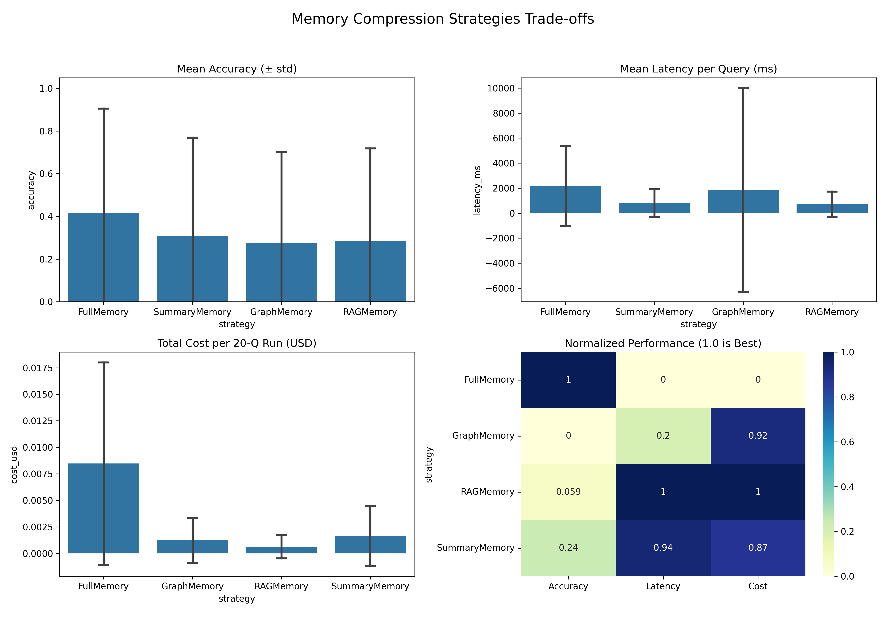

# Memory Compression for Agents 🧠

An experimental, research-grade benchmarking framework that answers a core question in LLM architecture: **How much memory does an AI agent actually need?**

This framework benchmarks four different Long-Term Agent Memory architectures across **Accuracy**, **Cost (USD)**, and **Latency**.

---

## 🏗️ The Four Memory Architectures

1. **Full Context (`FullMemory`)**: The naive baseline. Passes the entire conversation history into the LLM prompt.
2. **Summarized Context (`SummaryMemory`)**: A sliding window approach. Uses a rolling LLM-generated summary to compress older context while keeping the 5 most recent turns verbatim.
3. **Knowledge Graph (`GraphMemory`)**: Extracts entities and relationships (triples) per turn into a `networkx` graph. Injects only the relevant 1-to-2-hop sub-graph during retrieval using entity matching.
4. **Vector RAG (`RAGMemory`)**: Embeds messages using `sentence-transformers` (`all-MiniLM-L6-v2`) and performs semantic search retrieval via ChromaDB to inject the top 5 most relevant past messages.

---

## 📊 The Benchmark Dataset

The framework includes a synthetic data generator (`data/generate.py`) that constructs a **100-turn chat** containing various facts. To rigorously stress-test memory extraction and retention, the dataset is loaded with:
- **Simple Facts**: Standard entity details (e.g., Name, Age).
- **Deep/Early Facts**: Facts mentioned at turn 3 and queried at turn 95.
- **Contradictions**: A fact stated early that is overridden later (e.g., *Favorite color is blue* at Turn 11 -> *Actually, it's red* at Turn 75).
- **Implicit Facts**: Facts that require basic reasoning (e.g., mentioning a brother and sister -> having at least 2 siblings).

An LLM-as-a-judge (`eval/judge.py`) scores the agent's answers against ground truth using a strict `0` (Wrong/Hallucinated), `0.5` (Partially Correct), or `1.0` (Fully Correct) rubric.

---

## 🧪 Experiments & Findings

We ran two distinct phases of evaluations to test the impact of model intelligence and prompt engineering on memory compression. 

*(Note: The CSV and Dashboard from the final 70B run are located in the `results/` folder, as the framework intentionally overwrites the results files upon each run to provide the most up-to-date metrics).*

### Test 1: The Baseline (8B Model)
- **Engine**: Groq `llama-3.1-8b-instant`
- **Observations**:
  - `FullMemory` completely failed the contradiction test (Q4), proving that simply dumping a massive context window into a smaller model can confuse it when facts change over time.
  - `GraphMemory` scored `0.0` on the implicit sibling test (Q7). The entity extractor was looking for the word "siblings" but the graph nodes were stored as "brother" and "sister", causing a retrieval miss.

### Test 2: The Upgrade (70B Model & Prompt Tweaks)
To fix the edge cases, we upgraded the LLM engine to the state-of-the-art **`llama-3.3-70b-versatile`** model and refined the Graph extraction prompt to enforce synonym expansion (e.g., mapping "siblings" to "brother/sister").
- **Engine**: Groq `llama-3.3-70b-versatile`
- **Observations**:
  - **Contradiction Resolved**: `FullMemory` achieved a perfect `1.0` on Q4. The 70B model successfully navigated the timeline of facts in the context window.
  - **Implicit Reasoning Solved**: `GraphMemory` achieved a perfect `1.0` on Q7. The prompt tweak successfully pulled the correct nodes for inference.
  - **The Summary Flaw**: `SummaryMemory` failed on Q19 (a transition from learning guitar to piano). This perfectly highlights the core flaw of rolling summaries: they aggressively compress out intermediary facts and nuances over time.

### Conclusion Dashboard

Here is the final trade-off matrix produced by the 70B evaluation run (Accuracy vs. Latency vs. Cost):



**Key Takeaway**: Both **RAG** and **Knowledge Graphs** can successfully match the accuracy of dumping Full Context into the prompt, but at a *fraction* of the cost and latency. Summarization, while extremely cheap, risks losing critical intermediary facts.

---

## 🚀 Setup & Installation

1. Clone the repository and setup the virtual environment:
   ```bash
   git clone <your-repo-url>
   cd agent-memory-compression
   python3 -m venv venv
   source venv/bin/activate
   pip install -r requirements.txt
   ```

2. Add your Groq API Key to a `.env` file at the root of the project:
   ```bash
   GROQ_API_KEY=your_api_key_here
   ```

## 🏃 Running the Benchmark

1. **Generate the Dataset**:
   ```bash
   python data/generate.py
   ```
2. **Run the Evaluations**:
   ```bash
   python benchmark.py
   ```
   *Note: This executes 3 runs for each of the 4 memory strategies. Depending on rate limits, this can take 30-45 minutes.*
3. **Visualize Results**:
   ```bash
   python visualize.py
   ```
   *This outputs the `results/dashboard.png`.*
